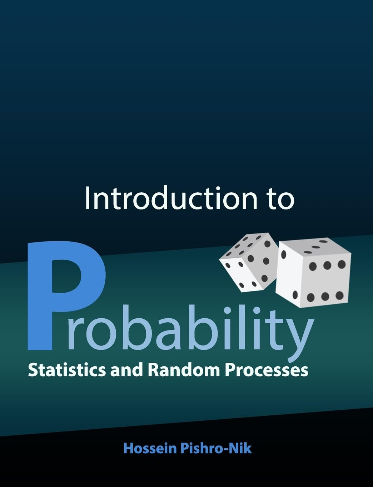

# itp-pishro  
Solutions and supplementary materials for *Introduction to Probability, Statistics, and Random Processes* by Hossein Pishro-Nik. This repository includes fully worked solutions, extended derivations, simulations, and interactive teaching tools to reinforce key concepts.

# 📘 ITP Solutions and Notes

  

> A companion project to *Introduction to Probability, Statistics, and Random Processes* by Hossein Pishro-Nik.  
> Contains complete problem solutions, annotated notes, extended derivations, simulations, and interactive visualizations.

---

## 📂 Repository Structure

- `chapters/` — Chapter-wise solutions and notes  
- `simulations/` — Interactive tools and visual aids  
- `notebooks/` — Jupyter notebooks for selected topics  
- `images/` — Book cover and visual resources  
- `CHANGELOG.md` — Update log and revision history

---

## 🧠 Features

- ✅ Complete solutions to all end-of-chapter exercises  
- 🧾 Annotated derivations and supplementary explanations  
- 🎛️ Interactive tools for key probability concepts  
- 📈 Visualizations and simulations to build intuition  
- 🧪 Jupyter notebooks for experimentation and exploration

---

## 🔄 Changelog

See [`CHANGELOG.md`](CHANGELOG.md) for the latest updates.

---

## 🛠️ Requirements

- Python 3.x  
- Common libraries: `numpy`, `matplotlib`, `ipywidgets`, `scikit-learn`, etc.  
(See `requirements.txt` for the full list)

---

## 📚 Chapters Completed

- [x] Chapter 1: Basic Concepts
- [x] Chapter 2: Combinatorics: Counting methods
- [ ] Chapter 3: Discrete Random Variables
- [ ] Chapter 4: Continuous Random Variables and Mixed Random Variables
- [ ] Chapter 5: Joint Distributions: Two Random Variables
- [ ] Chapter 6: Multiple Random Variables
*(...and more in progress)*

---

## 🧑‍🏫 Why this project?

While Pishro-Nik's book is accessible and comprehensive, readers often benefit from additional worked examples, intuitive explanations, and interactive elements. This repository aims to:

- Clarify complex concepts through visualizations and code  
- Offer readable, high-quality solutions  
- Serve as a study aid for students and educators alike

---

## 🤝 Contributing

Contributions and corrections are welcome!  
Please see `CONTRIBUTING.md`, or open an issue or pull request.

---

## 📸 Cover Image Credits

Cover image used under fair use for educational purposes only.  
Copyright ©  
Hossein Pishro-Nik / Authors / Publisher.
